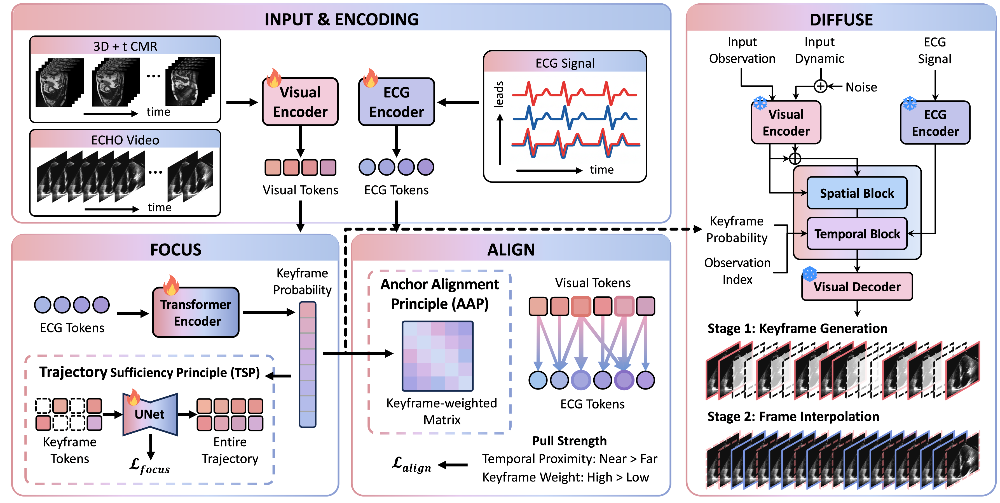

# CardioFAD

**CardioFAD** is a time-series-aware keyframe diffusion framework for **cardiac dynamic synthesis from sparse observations**.

Our core idea is to reformulate one-shot cardiac dynamic synthesis as a **recoverability–alignability anchor discovery** problem. Instead of treating all frames equally, CardioFAD learns motion-salient keyframes that are both sufficient to recover the visual trajectory and reliable for ECG–visual alignment.

CardioFAD follows a simple **Focus–Align–Diffuse** paradigm:

- 🎯 **Focus**, which discovers trajectory-sufficient keyframes
- 🔗 **Align**, which aligns ECG and visual dynamics around keyframe anchors
- 🌊 **Diffuse**, which generates dense cardiac dynamics through two-stage keyframe-to-sequence synthesis

By explicitly learning self-emergent anchors, CardioFAD improves visual quality, temporal coherence, and clinical fidelity under extreme one-shot sparsity.

## 🔎 Overview

Dense cardiac dynamics are important for assessing cardiac function, but in practice only sparse observations may be available, such as a single CMR slice, a single CMR volume, or a single ECHO frame.

CardioFAD addresses this challenge by first identifying motion-salient keyframes as anchors, then using them to guide full sequence generation.

<p align="center">
  
</p>

## 💡 Key Ideas

CardioFAD is built around two principle-level criteria and one generation strategy.

<table>
  <thead>
    <tr>
      <th align="left" width="34%">Component</th>
      <th align="left">Description</th>
    </tr>
  </thead>
  <tbody>
    <tr>
      <td>🎯 <b>Focus</b></td>
      <td>Learns motion-salient keyframes under the Trajectory Sufficiency Principle, encouraging selected anchors to preserve trajectory-critical visual dynamics.</td>
    </tr>
    <tr>
      <td>🔗 <b>Align</b></td>
      <td>Uses the Anchor Alignment Principle to perform keyframe-weighted ECG–visual alignment, making keyframes reliable cross-modal anchors.</td>
    </tr>
    <tr>
      <td>🌊 <b>Diffuse</b></td>
      <td>Performs two-stage generation by first synthesizing keyframes and then interpolating the remaining frames.</td>
    </tr>
  </tbody>
</table>

Together, these components reduce temporal ambiguity and enable ECG-guided cardiac dynamic synthesis from extremely sparse visual observations.

## ✨ Features

<table>
  <thead>
    <tr>
      <th align="left" width="34%">Feature</th>
      <th align="left">Description</th>
    </tr>
  </thead>
  <tbody>
    <tr>
      <td>🫀 <b>Cardiac dynamic synthesis</b></td>
      <td>Supports dense cardiac sequence generation from sparse observations.</td>
    </tr>
    <tr>
      <td>⚡ <b>One-shot setting</b></td>
      <td>Targets extreme sparsity, including single-volume, single-slice, and single-frame observations.</td>
    </tr>
    <tr>
      <td>🎯 <b>Self-emergent keyframes</b></td>
      <td>Learns keyframe anchors without relying on predefined ED/ES landmarks.</td>
    </tr>
    <tr>
      <td>🔗 <b>ECG-aware alignment</b></td>
      <td>Uses auxiliary time-series signals to guide phase-aware generation.</td>
    </tr>
    <tr>
      <td>🌊 <b>Two-stage diffusion</b></td>
      <td>Generates anchor keyframes first and completes the full cardiac trajectory afterward.</td>
    </tr>
    <tr>
      <td>📈 <b>Clinical fidelity</b></td>
      <td>Improves both standard synthesis metrics and clinically relevant cardiac function estimation.</td>
    </tr>
  </tbody>
</table>

## 📊 Experimental Scope

CardioFAD is evaluated on both **3D+t CMR** and **2D+t ECHO** synthesis tasks.

**3D+t CMR synthesis**

- Volume2Seq
- Slice2Seq

**2D+t ECHO synthesis**

- Frame2Video on EchoNet-Dynamic
- Frame2Video on EchoNet-Pediatric A4C
- Frame2Video on EchoNet-Pediatric PSAX

The experiments evaluate visual quality, temporal consistency, and clinical fidelity using metrics such as PSNR, SSIM, LPIPS, FID, FVD, and EF estimation.

## 🛠️ Usage

**Tokenizer**
To train the tokenizer for CMR synthesis, run:

```bash
python train_tokenizer_CMR.py
```

**Generation**
To train the diffusion model for CMR Volume2Seq synthesis, run:

```bash
python train_volume2temp.py
```

To train the diffusion model for CMR Slice2Seq synthesis, run:

```bash
python train_slice2temp.py
```
